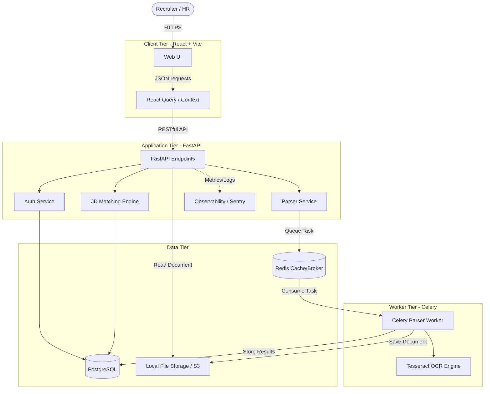

# System Architecture

The Resume Parser AI platform is built upon a decoupled, service-oriented architecture designed for scalability, maintainability, and high observability.

## High-Level Architecture Diagram

## Component Breakdown

### 1. Client Tier (Frontend)
- **Technology**: React 18, TypeScript, Vite.
- **Routing**: `react-router-dom` manages protected and unprotected routes.
- **State Management**: `@tanstack/react-query` is utilized for server-state synchronization (caching, deduplication, optimistic updates).
- **Styling**: Tailwind CSS combined with Base UI primitives for an accessible, headless design system.

### 2. Application Tier (Backend)
- **Technology**: FastAPI, Python 3.13.
- **Concurrency**: Uvicorn runs the ASGI application utilizing Python's `asyncio` for non-blocking network I/O.
- **Authentication**: JWT-based stateless authentication. All tokens are signed symmetrically (`HS256`).
- **Observability**: Implements `prometheus-fastapi-instrumentator` for /metrics, `asgi-correlation-id` for distributed request tracing, and Sentry for error telemetry.

### 3. Worker Tier (Asynchronous Processing)
- **Technology**: Celery + Redis.
- **Purpose**: Parsing a resume (especially using PyTesseract for OCR) is CPU-bound and latent. Celery shifts this load off the FastAPI event loop, ensuring the web server remains responsive.
- **Flow**: Upload -> Store File -> Enqueue Task -> Return Job ID -> Worker parses -> Update DB.

### 4. Data Tier
- **Relational Database**: PostgreSQL. Interfaced via SQLAlchemy 2.0 ORM.
- **Schema Migrations**: Managed declaratively via Alembic.
- **Object Storage**: Resumes are currently written to a local `./uploads` directory. In production, this layer abstract is designed to easily swap to AWS S3 or Azure Blob Storage.
